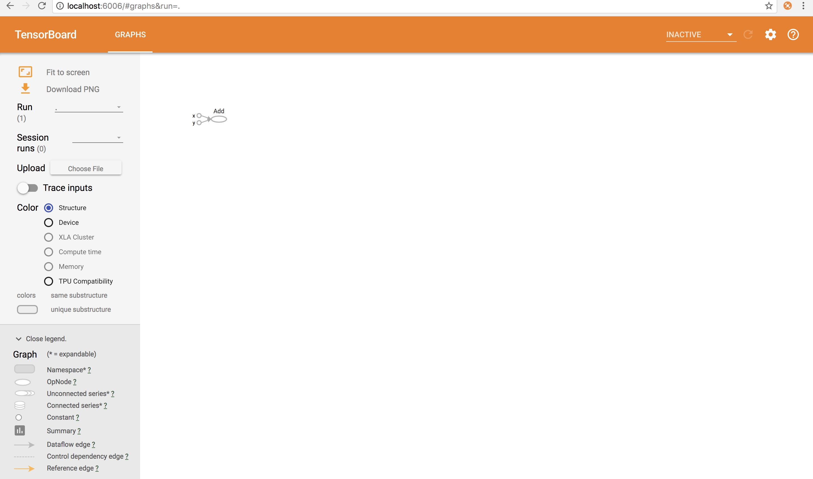
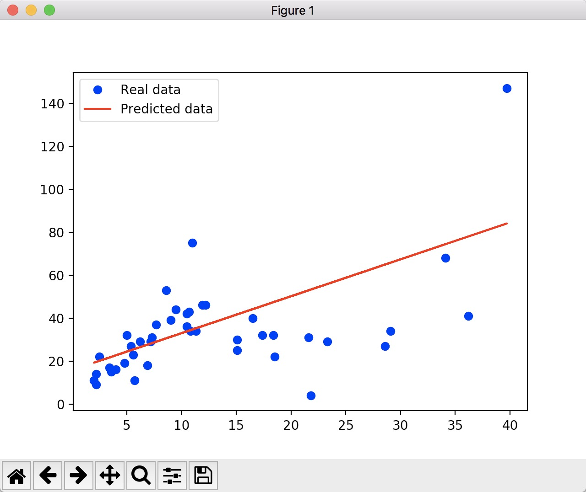
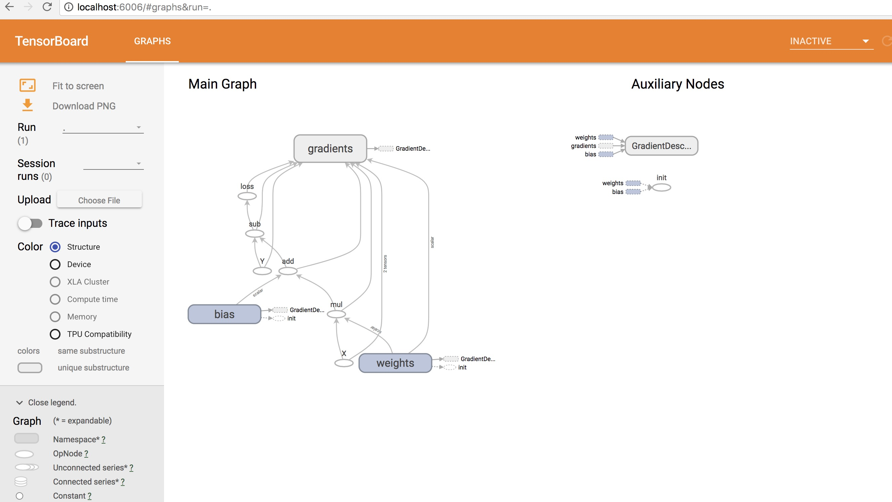
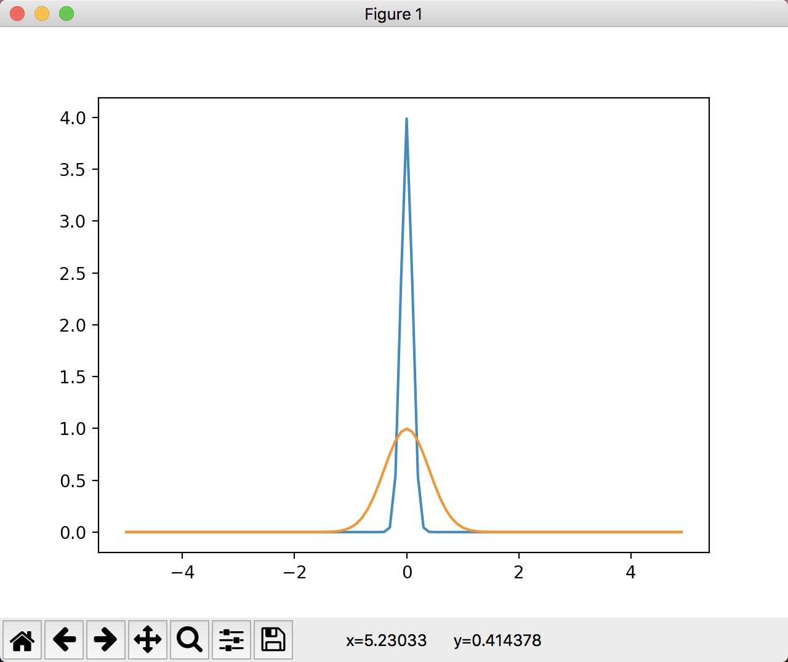
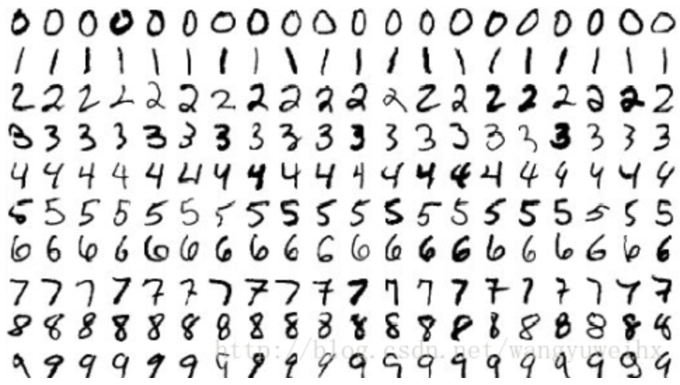

# tensorflow-learning
tensorflow学习  

1. 定义模型
```python
import tensorflow as tf
import numpy as np

# 定义模型
a = tf.add(2,3)

# 输出
print(a)
```
输出:
```  
Tensor("Add:0", shape=(), dtype=int32)  
```

2. 定义模型并执行结果
```python  
import tensorflow as tf
import numpy as np

# 定义模型
a = tf.add(2,3)

# 开启session
sess = tf.Session()

# 输出
print(sess.run(a))

# 关闭session
sess.close()
```  
输出:
```  
2018-04-08 13:00:17.952598: I tensorflow/core/platform/cpu_feature_guard.cc:140] Your CPU supports instructions that this TensorFlow binary was not compiled to use: AVX2 FMA
5
```

3. 使用tensorBoard
```python
import tensorflow as tf

# 定义模型
a = tf.add(2.0,3.0)

# 获取session
sess = tf.Session()

# 输出图到当前路径下到train目录
writer = tf.summary.FileWriter("train", sess.graph)

# 加载模型
sess.run(a)

# 关闭session
sess.close()

# 关闭写入
writer.close()
```  

3.1 命令行启动tensorBoard(进入程序路径，指定tensorBoard可视化日志目录)
```
tensorboard --logdir=train
```  

3.2 web访问tensorBoard
```
http://localhost:6006/
```
3.3 访问结果  
  

4. 查看tensorflow版本(cpu还是gpu版本)
```python

import tensorflow as tf

# 定义模型
a = tf.add(2.0,3.0)

# 获取session,配置输出设备日志
sess = tf.Session(config=tf.ConfigProto(log_device_placement=True))

# 加载模型
sess.run(a)

# 关闭session
sess.close()
```  
控制台输出内容，可以看出是cpu还是gpu工作:  
```
2018-04-09 10:05:04.258885: I tensorflow/core/platform/cpu_feature_guard.cc:140] Your CPU supports instructions that this TensorFlow binary was not compiled to use: AVX2 FMA
Device mapping: no known devices.
2018-04-09 10:05:04.259206: I tensorflow/core/common_runtime/direct_session.cc:297] Device mapping:

Add: (Add): /job:localhost/replica:0/task:0/device:CPU:0
2018-04-09 10:05:04.260529: I tensorflow/core/common_runtime/placer.cc:875] Add: (Add)/job:localhost/replica:0/task:0/device:CPU:0
Add/y: (Const): /job:localhost/replica:0/task:0/device:CPU:0
2018-04-09 10:05:04.260546: I tensorflow/core/common_runtime/placer.cc:875] Add/y: (Const)/job:localhost/replica:0/task:0/device:CPU:0
Add/x: (Const): /job:localhost/replica:0/task:0/device:CPU:0
2018-04-09 10:05:04.260624: I tensorflow/core/common_runtime/placer.cc:875] Add/x: (Const)/job:localhost/replica:0/task:0/device:CPU:0
```  

5. 指定设备进行操作  
```python
import tensorflow as tf

# 指定运行操作的设备，/cpu:0其中的0表示设备号，TF不区分CPU的设备号，设置为0即可。
# 设置cpu运行时Tensor是储存在内存里的，而非显存里。gpu快的原因也是因此，
# 减少了数据从内存传输的时间，直接在显存中完成。
with tf.device('/cpu:0'):
    a = tf.constant([1.0, 2.0, 3.0, 4.0, 5.0, 6.0], shape=[2, 3], name='a')
    b = tf.constant([1.0, 2.0, 3.0, 4.0, 5.0, 6.0], shape=[3, 2], name='b')
    c = tf.matmul(a, b)

# 获取session,配置输出设备日志
sess = tf.Session(config=tf.ConfigProto(log_device_placement=True))

# 加载模型
print(sess.run(c))
```  

6. 指定图进行操作  
```python
import tensorflow as tf

# 创建新图
g = tf.Graph()

# 将新图设置成默认图，并指定模型
with g.as_default():
    x = tf.add(3,5)

# 创建指定图的session
sess = tf.Session(graph=g)

# 执行模型
sess.run(x)

# 关闭session
sess.close()
```  

7. 指定多个图进行操作（这里深入的区别还是没看出来，可能是因为我mac本没有gpu的原因，暂时先这么理解。）  
```python
import tensorflow as tf

# 获取默认graph
g1 = tf.get_default_graph()

# 创建一个新graph
g2 = tf.Graph()

# 指定图1的模型
with g1.as_default():
    a = tf.constant(3)

# 指定图2的模型
with g2.as_default():
    b = tf.constant(5)


# 获取graph1的session，并输出设备日志
with tf.Session(graph=g1,config=tf.ConfigProto(log_device_placement=True)) as sess1:
    # 定义模型
    x1 = tf.add(3,5)
    # 输出图到当前路径下到train目录
    writer1 = tf.summary.FileWriter("train", sess1.graph)
    # 加载模型
    sess1.run(x1)

    # 关闭写入
    writer1.close()

# 获取graph2的session，并输出设备日志
with tf.Session(graph=g2,config=tf.ConfigProto(log_device_placement=True)) as sess2:
    # 定义模型
    x2 = tf.multiply(4,6)
    # 输出图到当前路径下到train目录
    writer2 = tf.summary.FileWriter("train", sess2.graph)
    # 加载模型
    sess2.run(x2)

    # 关闭写入
    writer2.close()
```  

8. 线性回归（火灾预测）
```
我们经常听说保险公司使用例如一个社区的火灾和盗贼去衡量一个社区的安全程度，我的问题是，这是不是多余的，
火灾和盗贼在一个社区里是否是相关的，如果相关，那么我们能不能找到他们的关系

换句话说，我们能不能找到一个函数f，如果X是火灾数并且Y是盗贼数，是否存在Y=f(X)？

给出这个关系，如果我们有特定社区的火灾数我们能不能预测这一区域的盗贼数

我们有 the U.S. Commission on Civil Rights, courtesy of C engage Learning 的一
个数据集(data目录下的fire_theft.xls文件)

数据集描述：
名称：芝加哥的火灾和盗贼
X=每1000住房单元的火灾数
Y=每1000人口的盗贼数
每对数据取自地区码不同的芝加哥的42个区域

方案：
首先假设火灾数和盗贼数成线性关系：Y=wX+b
我们需要找到参数w和b，通过平方差误差作为的损失函数：（Y - Y_predicted)²
```  
实现代码如下：
```python
import numpy as np
import matplotlib.pyplot as plt
import tensorflow as tf
import xlrd

# 火灾数据集文件路径
DATA_FILE = 'data/fire_theft.xls'

# 读取xls文件
book = xlrd.open_workbook(DATA_FILE, encoding_override="utf-8")

# 获得第一个sheet
sheet = book.sheet_by_index(0)

# 取出每一行的值构建成数组
# 1.for i in range(1, sheet.nrows)遍历sheet的所有行
# 2.sheet.row_values(i)取出一行的值
# 3.np.asarray(...）构建成数组
data = np.asarray([sheet.row_values(i) for i in range(1, sheet.nrows)])

# 样本数量
n_samples = sheet.nrows - 1

# 定义占位符，并起名
X = tf.placeholder(tf.float32, name='X')
Y = tf.placeholder(tf.float32, name='Y')

# 定义变量，初始化为0，并起名
w = tf.Variable(0.0, name='weights')
b = tf.Variable(0.0, name='bias')

# 创建模型预测Y Y=wX+b
Y_predicted = X * w + b

# 使用平方误差构建损失函数（Y - Y_predicted)²
loss = tf.square(Y - Y_predicted, name='loss')

# 使用实现梯度下降算法的优化器，初始学习率为0.001，最小化损失函数
optimizer = tf.train.GradientDescentOptimizer(learning_rate=0.001).minimize(loss)

# 获取session
with tf.Session() as sess:
    # 初始化全局变量（比如:w和b）
    sess.run(tf.global_variables_initializer())

    # 输出图到当前路径下到train目录
    writer = tf.summary.FileWriter('train', sess.graph)

    # 训练模型100次
    for i in range(100):
        # 初始化损失函数为0
        total_loss = 0
        for x, y in data:
            # 获取损失函数的值（sess.run执行了optimizer, loss 2个函数，_, lost表示分别赋值函数执行结果，_表示忽略结果）
            _, lost = sess.run([optimizer, loss], feed_dict={X: x, Y:y})
            # 累加总损失函数的值
            total_loss += lost
        # 输出每次的训练平均损失值 （截止到当次循环完成的总损失值/总样本数）
        print ('Epoch {0}: {1}'.format(i, total_loss/n_samples))

    # 执行模型并输出模型结果
    w_value, b_value = sess.run([w, b])

    # 关闭输出
    writer.close()

# 取出值
X, Y = data.T[0], data.T[1]

# 真实值图形显示
plt.plot(X, Y, 'bo', label='Real data')

# 预测数据图形显示
plt.plot(X, X * w_value + b_value, 'r', label='Predicted data')

# 添加图例的标注
plt.legend()

# 展示图形
plt.show()
```  
图形结果：  
  

tensorBoard结果：


9. 逻辑回归（手写体识别）

【准备知识】正态分布标准差影响:
```python
import matplotlib.pyplot as plt
import numpy as np
from scipy import stats

x = np.arange(-5, 5, 0.1)
y = stats.norm.pdf(x, 0, 0.1)
z = stats.norm.pdf(x, 0, 0.4)


plt.plot(x, y)
plt.plot(x, z)
plt.show()
```



【准备api】tf.random_normal(从正态分布输出随机值)

```
random_normal(shape,mean=0.0,stddev=1.0,dtype=tf.float32,seed=None,name=None)

shape：一个一维整数张量或Python数组。代表张量的形状。
mean：数据类型为dtype的张量值或Python值。是正态分布的均值。
stddev：数据类型为dtype的张量值或Python值。是正态分布的标准差
dtype： 输出的数据类型。
seed：一个Python整数。是随机种子。
name： 操作的名称(可选)
```

举例:

```python
import tensorflow as tf

random_normal = tf.random_normal(shape=[2, 3], stddev=0.01)

with tf.Session() as sess:
    print(sess.run(random_normal))
```

输出结果:

```
[[ 0.00537214  0.00920044 -0.00689021]
 [ 0.01100144 -0.00340243  0.00528982]]
```

【准备api】tf.zeros(创建一个所有的参数为０的tensor对象)

```python
import tensorflow as tf

a = tf.zeros([2, 10])

sess = tf.Session()

print(sess.run(a))
```

输出:

```
[[ 0.  0.  0.  0.  0.  0.  0.  0.  0.  0.]
 [ 0.  0.  0.  0.  0.  0.  0.  0.  0.  0.]]
```

【准备api】tf.matmul(矩阵相乘)

```python
import tensorflow as tf

a = tf.random_uniform([2, 3], 0, 10, tf.int32)
b = tf.random_uniform([3, 4], 0, 10, tf.int32)

c = tf.matmul(a, b)

sess = tf.Session()

print(sess.run(a))
print("-----------")
print(sess.run(b))
print("-----------")
print(sess.run(c))
```

输出:

```
[[6 1 0]
 [1 2 2]]
-----------
[[5 8 7 2]
 [6 4 7 0]
 [1 0 6 7]]
-----------
[[ 98  28  24  61]
 [106  68  75  59]]
```

【准备api】tf.reduce_mean(按某一维度(reduction_indices)计算一个张量的个元素的平均值。)

```
tf.reduce_mean(input_tensor,  axis=None,  keep_dims=False,  name=None,  reduction_indices=None)


input_tensor: 被计算的张量，确保为数字类型。

axis: 方向数轴，如果没有指明，默认是所有数轴都减小为1。

keep_dims: 如果定义true, 则保留维数，但数量个数为0.

name: 操作过程的名称。

reduction_indices: 为了旧函数兼容的数轴。

返回值:降低维数的平均值。

```

举例:

```python
import tensorflow as tf

# 定义张量
x = [[2, 3, 1],
     [2, 1, 3],
     [4, 5, 6]]

# 全部数值求和取平均值
reduce_mean = tf.reduce_mean(x)
# 保留y轴（列），x轴(行)求平均
reduce_mean_x = tf.reduce_mean(x, axis=1, keep_dims=True)
# 保留x轴（行），y轴(列)求平均
reduce_mean_y = tf.reduce_mean(x, axis=0, keep_dims=True)

with tf.Session() as sess:

    # （（2+3+1）+（2+1+3）+（4+5+6））／9 = 3
    print(sess.run(reduce_mean))

    # [
    # [(2+3+1)/3=2]
    # [(2+1+3)/3=2]
    # [(4+5+6)/3=5]
    #  ]
    print(sess.run(reduce_mean_x))

    #[[(2+2+4)/3=2  (3+1+5)/3=3 (1+3+6)/3=3]]
    print(sess.run(reduce_mean_y))
```

输出结果:

```
3

[[2]
 [2]
 [5]]

[[2 3 3]]
```

【准备api】tf.nn.softmax(n分类模型)

```
tf.nn.softmax(logits, name=None)

logits：就是神经网络最后一层的输出，如果有batch的话，它的大小就是[batchsize，num_classes]，单样本的话，大小就是num_classes。

name：操作的名称(可选)
```

```python
import tensorflow as tf

A = [1.0, 2.0, 3.0, 4.0, 5.0, 6.0]

with tf.Session() as sess:
    print(sess.run(tf.nn.softmax(A)))
```

输出:

```
[ 0.00426978  0.01160646  0.03154963  0.08576079  0.23312201  0.63369131]
```

【准备api】tf.nn.softmax_cross_entropy_with_logits_v2()

```
tf.nn.softmax_cross_entropy_with_logits_v2(logits, labels, name=None)

logits：就是神经网络最后一层的输出，如果有batch的话，它的大小就是[batchsize，num_classes]，单样本的话，大小就是num_classes。

labels：实际的标签，如果有batch的话，它的大小就是[batchsize，num_classes]，单样本的话，大小就是num_classes。

name：操作的名称(可选)
```

【数据集介绍】MNIST可能是最受欢迎的数据集之一，被用于各种图像处理模型，他是一个首页数字的数据集，每个图片28*28像素，
 拉伸为1维张量长度为784，每一个都有一个标签，比如第一行标签为0，第二行为1……
 TFLearn（tf的一个简单接口）有一个让你可以从Yan Lecun个人网站加载MNIST数据集的脚本，并且把它分为训练集，验证集和测试集，图片如下：



```python
import tensorflow as tf
from tensorflow.examples.tutorials.mnist import input_data
import time

# 定义模型参数
# 学习率
learning_rate = 0.01
# 批量大小
batch_size = 128
#
n_epochs = 30

# 读取数据集并进行one hot编码
# TFLearn（tf的一个简单接口）有一个让你可以从Yan Lecun个人网站加载MNIST数据集的脚本，并且把它分为训练集，验证集和测试集
mnist = input_data.read_data_sets("data/mnist", one_hot=True)

# 定义批量占位符
# 每个图片28*28像素，拉伸为1维张量长度为784（28*28 = 784）
# 每个图像有10个类，对应于数字0 - 9
X = tf.placeholder(tf.float32, [batch_size, 784], name="image")
Y = tf.placeholder(tf.float32, [batch_size, 10], name="label")

# 定义变量
w = tf.Variable(tf.random_normal(shape=[784, 10], stddev=0.01), name='weights')
b = tf.Variable(tf.zeros([1, 10]), name="bias")

# 矩阵相乘再加上偏移
logits = tf.matmul(X, w) + b

# softmax模型(注意版本)
entropy = tf.nn.softmax_cross_entropy_with_logits_v2(logits=logits, labels=Y, name='loss')

# 求所有样本平均值
loss = tf.reduce_mean(entropy)

# 使用实现梯度下降算法的优化器，初始学习率为0.001，最小化损失函数
optimizer = tf.train.GradientDescentOptimizer(learning_rate).minimize(loss)

with tf.Session() as sess:
    # 输出图到当前路径下到train目录
    writer = tf.summary.FileWriter('train', sess.graph)

    # 获取时间
    start_time = time.time()

    # 初始化全局变量（比如:w和b）
    sess.run(tf.global_variables_initializer())

    # 计算训练集总批次 （总训练样本/批量输入大小）
    n_batches = int(mnist.train.num_examples / batch_size)

    # 训练模型
    for i in range(n_epochs):
        # 初始化总损失
        total_loss = 0

        # 循环批次
        for _ in range(n_batches):
            # 批量导入训练集数据
            X_batch, Y_batch = mnist.train.next_batch(batch_size)

            # 获取损失函数的值（sess.run执行了optimizer, loss 2个函数，_, lost表示分别赋值函数执行结果，_表示忽略结果）
            _, loss_batch = sess.run([optimizer, loss], feed_dict={X: X_batch, Y: Y_batch})

            # 累加总损失函数的值
            total_loss += loss_batch

        # 输出平均损失(总损失／总批次)
        print('Average loss epoch {0}: {1}'.format(i, total_loss / n_batches))

    # 输出训练模型总耗时
    print('Total time: {0} seconds'.format(time.time() - start_time))

    # 输出优化完成
    print('Optimization Finished!')

    # 测试模型
    # 计算测试集总批次 （总测试样本/批量输入大小）
    n_batches = int(mnist.test.num_examples / batch_size)

    # 总预测
    total_correct_preds = 0

    # 循环批次测试
    for i in range(n_batches):
        # 批量导入测试集数据
        X_batch, Y_batch = mnist.test.next_batch(batch_size)

        # 运行优化器，损失函数，
        _, loss_batch, logits_batch = sess.run([optimizer, loss, logits], feed_dict={X: X_batch, Y: Y_batch})

        # 数学模型
        preds = tf.nn.softmax(logits_batch)
        correct_preds = tf.equal(tf.argmax(preds, 1), tf.argmax(Y_batch, 1))
        accuracy = tf.reduce_sum(tf.cast(correct_preds, tf.float32))

        # 累加总预测
        total_correct_preds += sess.run(accuracy)

    # 输出准确率
    print('Accuracy {0}'.format(total_correct_preds / mnist.test.num_examples))

    # 关闭输出
    writer.close()
```

对应图如下：  


